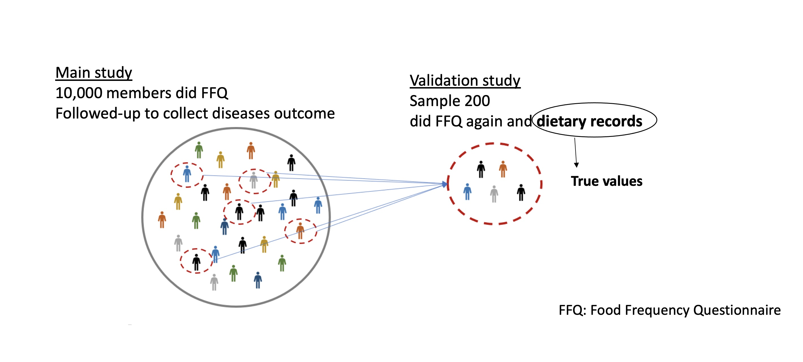

BST260 final project
================
Yiyang Yue
2022-12-12

- <a href="#introduction" id="toc-introduction">Introduction</a>
- <a href="#results" id="toc-results">Results</a>
  - <a href="#part-1-validation-study-on-ffq-derived-dietary-indices"
    id="toc-part-1-validation-study-on-ffq-derived-dietary-indices">PART 1.
    Validation study on FFQ derived dietary indices.</a>
  - <a
    href="#part-2-simulation-analysis-on-measurement-error-in-ffq-estimates"
    id="toc-part-2-simulation-analysis-on-measurement-error-in-ffq-estimates">PART
    2. Simulation analysis on measurement error in FFQ estimates</a>
- <a href="#conclusion" id="toc-conclusion">Conclusion</a>
- <a href="#reference" id="toc-reference">Reference</a>
- <a href="#appendix" id="toc-appendix">Appendix</a>
  - <a href="#tables-and-figures" id="toc-tables-and-figures">Tables and
    Figures</a>
  - <a href="#analysis-code" id="toc-analysis-code">Analysis Code</a>

# Introduction

Nowadays, food frequency questionnaires (FFQs) have been the primary
method of dietary assessment in large cohort studies of diet and health
outcomes, because they can be self-administered, efficiently processed,
and provide data on individual intakes of both foods and nutrients over
an extended period (1). However, FFQ estimates rely on memory and hence
prone to recall bias. Other sources of error in FFQ estimates include
misinterpretation about portion size, omitting food, and so on.
Therefore, it is is critical to document the validity of FFQ estimates
(nutrients, foods, and dietary scores) and quantify the impact of these
measurement errors in the diet and disease associations.

In this project, we first evaluated the reproducibility and validity of
a FFQ in measuring three dietary scores: overall plant-based diet
indices (PDI), healthful plant-based diet index (hPDI), and unhealthful
plant-based diet index (uPDI) and their scoring components: healthful
plant foods (hplant), unhealthful plant foods (uplant), total plant
foods (tplant), and animal foods (animal) (2). The scoring methods of
these plant-based indices were shown in the **Figure 1**. This analysis
included 742 participants from the Women’s Lifestyle Validation Studies
(3, 4). Participants completed a 152-item FFQ at the beginning of the
study (FFQ1) and one year later (FFQ2) and completed two weighed 7-day
dietary records (DR_wk1 and DR_wk2) six-month apart between FFQ
assessments (**Table 1**). The reproducibility of the FFQs was evaluated
by rank intraclass correlation coefficients (ICC) with two repeated FFQ
assessments (5). The validity was assessed by comparing FFQ2-derived
DQSs to those from the average of two 7DDRs (DR_avg) using Spearman rank
correlation coefficients (rs), because we are more interested in ranking
the population correctly (6, 7). Calibration coefficients were obtained
as slopes from linear regression models with FFQ estimates as
independent (predictor) variables and estimates from the average of the
two 7DDRs as dependent (outcome) variables (8-10).

We also conducted a simulation analysis to assess the effect of
measurement error in FFQ estimates on diseases risk estimation and
applied the linear approximation to correct the measurement errors (11)
. We would simulate a main study with 5,000 participants where
FFQ-derived exposures with error (Z) and outcome status (D) were
collected. Then, would sample an internal validation (n=500) from the
main study where the exposure estimates from FFQ (Z) and dietary records
(X) were collected (**Figure 2** ). We assumed FFQ estimates with
within-person errors: $Z=\lambda X+ \alpha + \epsilon_r$, where
$\epsilon_r \sim N (0, \sigma)$. The exposure-diseases associations
would be represented by a logistic model:
$logit (P(D=1|X))=\alpha+\beta X$. With FFQ-derived exposures, the
observed exposure-diseases associations would be
$logit (P(D=1|X))=\alpha_{obs}+\beta _{obs} Z$.

For the analysis part,  
1. The uncorrected coefficients $\hat{\beta_{obs}}$ and
$Var (\hat{\beta_{obs}})$ would be obtained from the main study  
2. The $\hat{\lambda}$ and $Var(\hat{\lambda})$ would be obtained from
the validation study  
3. We would apply the Linear approximation to correct the
$\hat{\beta_{obs}}$:
$$ \hat{\beta_{cor}}=\hat{\beta_{obs}}/\hat{\lambda}$$  
4. Variance of corrected coefficients would be obtained by delta method.
$$ Var(\hat{\beta_{cor}})=\frac{1}{\hat{\lambda}^2}Var(\hat{\beta_{obs}})+\frac{\hat{\beta_{obs}}^2}{\hat{\lambda}^4}Var(\hat{\lambda})$$

We would consider several scenarios with different degree of measurement
error ($\lambda$), prevalence of diseases (CI), as well as strength of
associations (odds ratio (OR)). For each combination of parameters, we
would iterate the simulation process 1,000 times to assess the RMSE of
the uncorrected and corrected $\beta$ estimates and its convergency
probability of the true $\beta$. We would also assess the direction and
degree of bias in estimated odds ratio by calculating the percentage of
bias.

# Results

## PART 1. Validation study on FFQ derived dietary indices.

We observed weak correlations between PDI and the other two plant-based
diet indices (rs=0.20 with hPDI and -0.10 with uPDI. Because higher hPDI
represented higher dietary quality and higher uPDI represented lower
dietary quality, the hPDI is inversely associated with uPDI as expected
(rs=-0.39) . The strength of correlations between plant-based diet
indices and their scoring components ranges from 0 for animal food and
PDI to 0.80 for total plants and PDI (**Figure 3**).

The FFQ-derived estimates from two assessments taken one year apart
demonstrated moderate to high reproducibility (ICC_FFQs =0.54 to 0.77)
that are slightly higher than the reproductivity of two dietary records
(ICC_DRs=0.50 to 0.68; **Table 2**). Using the average estimates of two
dietary records as the comparison method, FFQ-derived three plant-based
diet indices showed relatively high validity (rs=0.47 to 0.63), whereas
FFQ were less valid to estimate their scoring components (rs= 0.30 to
0.63; **Table 3**). We also visualized the validity results in the
**Figure 4** where we plotted the estimates from the average of the two
dietary records against FFQ estimates. Here, we found the calibration
coefficients (slopes) and R^2 were generally higher for three
plant-based diet indices than their scoring components, suggesting the
FFQ-derived plant-based diet indices were more comparable with their
true estimates from dietary records.

## PART 2. Simulation analysis on measurement error in FFQ estimates

In the simulation procedure,  
\* We first assumed a standardized normally distributed true intake
$X_i~N(0,1)$ within the overall study population.  
\* Then, we derived the FFQ estimates with systematic and random error
$Z_i=X_i+E_i+\epsilon_i$ where half of the population over-report with
$E_i \sim N(1,(1-\lambda)/\lambda)$ and the other half of the population
under-report with $E_i \sim N(-1,(1-\lambda)/\lambda )$. All study
participants followed the same random error distribution:
$\epsilon_i \sim N(0,0.001)$.  
\* Next, we simulated the diseases status according to the binominal
distribution
$$P(D=1|X_i)=\frac{\exp(\alpha+\beta X_i)}{1+\exp(\alpha+\beta X_i)}$$
where $\alpha=logit(CI)$ and \$beta=log(OR) \$ \* The 500 observations
in the validation study were then sampled from the main study.

We developed a user-friendly algorithm to assess the impact of
measurement errors in dietary exposures on their associations with
diseases outcome (simu_resul). Using this algorithm, readers can choose
their own sets of parameters under different conditions.

In the current analysis, we mainly focused on changes of three
parameters: the degree of measurement error ($\lambda$= 0.2, 0.4,0.6,
and 0.8), the prevalence of diseases (CI=0.05, 0.1, 0.3, 0.5), and the
strength of associations (true OR= 1.2, 1.5, 2, 2.5). According to
**Figure 5** for the percentage of bias of the crude estimates under
different scenarios, we found measurement errors embedded in the
exposures tend to attenuate (bias towards the null) the ORs, and this
bias would be exacerbated with less valid FFQ-derived exposures (smaller
lambda) and stronger exposure-diseases associations (larger OR).

**Figures 6-8** show the comparison results before and after measurement
error correction. We observed the corrected beta estimates (blue) always
have smaller (red) RMSE than the uncorrected ones (**Figure 6**). In
addition, the coverage probability of true value is extremely low for
uncorrected estimates, and much higher for the corrected
estimates(**Figure 7**). This might be due to 1) more bias in the
uncorrected estimates, and 2) larger variance and wider confidence
interval for the corrected estimates. We also found the bias in ORs
decreased after applying measurement error correction (**Figure 8**).

# Conclusion

This study highlights that a 152-item, semi-quantitative FFQ is
appropriate for ranking individuals to evaluate the dietary scores.
Dietary scores derived from the FFQ showed moderate to high
reproducibility when comparing estimates one year apart, and validity
when compared with dietary scores derived from two weighed 7DDRs
collected over 1 year. However, measurement error in FFQ estimates
cannot be overlook. In the simulation analysis part, we demonstrated
that the measurement error in FFQ-derived dietary exposures could
distort the associations with health outcomes. Furthermore, we found
applying appropriate measurement error correction methods could
alleviate the bias. Therefore, in the future nutritional epidemiology
studies, it is essential to validate the dietary exposures, as well as
consider conducting measurement error correction analysis to justify
their main findings.

Our current study also has some limitations which can be improved.
First, we did find there are day-to-day random variation in dietary
records (ICC\<1), which would attenuate the validity estimates based on
spearman correlation between dietary values derived from FFQ and dietary
records. Hence, we can use Rosner. et al.’s method to account for the
random variation in dietary records (12). Second, generalizability may
be limited because our study population were all women due to the data
availability issue. We can repeat the current analysis in Men’s
lifestyle validation study to further confirm our results. Third, we
have only considered single dietary exposure in the simulation analysis.
However, many dietary variables are correlated (e.g., energy intake is
positively correlated with macronutrients and food intakes) and they
could confound each other with diseases associations. Therefore, in the
real-world analysis, we would usually include several dietary variables
measured with error in the same model and need to use mthod that can
correct measurement errors for multiple variables at the same time.
Rosner. et al.’s have developed a multivariate correction method that
can handle both the error with which each variable is measured and the
correlation of errors (13).

# Reference

1.  Willett W. Nutritional epidemiology: Oxford University Press, 2012.
2.  Satija A, Hu FB. Plant-based diets and cardiovascular health. Trends
    Cardiovasc Med 2018;28(7):437-41. doi: 10.1016/j.tcm.2018.02.004.
3.  Colditz GA, Manson JE, Hankinson SE. The Nurses’ Health Study:
    20-year contribution to the understanding of health among women. J
    Womens Health 1997;6(1):49-62. doi: 10.1089/jwh.1997.6.49.
4.  Cho E, Chen WY, Hunter DJ, Stampfer MJ, Colditz GA, Hankinson SE,
    Willett WC. Red meat intake and risk of breast cancer among
    premenopausal women. Archives of internal medicine
    2006;166(20):2253-9. doi: 10.1001/archinte.166.20.2253.
5.  Koo TK, Li MY. A Guideline of Selecting and Reporting Intraclass
    Correlation Coefficients for Reliability Research. J Chiropr Med
    2016;15(2):155-63. doi: 10.1016/j.jcm.2016.02.012.
6.  Rosner B, Glynn RJ. Interval estimation for rank correlation
    coefficients based on the probit transformation with extension to
    measurement error correction of correlated ranked data. Statistics
    in medicine 2007;26(3):633-46. doi: 10.1002/sim.2547.
7.  Perisic I, Rosner B. Comparisons of measures of interclass
    correlations: the general case of unequal group size. Statistics in
    medicine 1999;18(12):1451-66. doi:
    10.1002/(sici)1097-0258(19990630)18:12\<1451::aid-sim142\>3.0.co;2-k.
8.  Bingham SA, Gill C, Welch A, Cassidy A, Runswick SA, Oakes S, Lubin
    R, Thurnham DI, Key T, Roe L. Validation of dietary assessment
    methods in the UK arm of EPIC using weighed records, and 24-hour
    urinary nitrogen and potassium and serum vitamin C and carotenoids
    as biomarkers. International journal of epidemiology
    1997;26(suppl_1):S137.
9.  Rosner B, Spiegelman D, Willett W. Correction of logistic regression
    relative risk estimates and confidence intervals for measurement
    error: the case of multiple covariates measured with error. American
    journal of epidemiology 1990;132(4):734-45.
10. Kaaks R, Riboli E, Van Staveren W. Calibration of dietary intake
    measurements in prospective cohort studies. American journal of
    epidemiology 1995;142(5):548-56.
11. Rosner B, Willett WC, Spiegelman D. Correction of logistic
    regression relative risk estimates and confidence intervals for
    systematic within-person measurement error. Stat Med
    1989;8(9):1051-69; discussion 71-3. doi: 10.1002/sim.4780080905.
12. Rosner B, Willett WC. Interval estimates for correlation
    coefficients corrected for within-person variation: implications for
    study design and hypothesis testing. Am J Epidemiol
    1988;127(2):377-86. doi: 10.1093/oxfordjournals.aje.a114811.
13. Spiegelman D, McDermott A, Rosner B. Regression calibration method
    for correcting measurement-error bias in nutritional epidemiology.
    The American journal of clinical nutrition 1997;65(4
    Suppl):1179S-86S. doi: 10.1093/ajcn/65.4.1179S.

# Appendix

## Tables and Figures


**Figure 1**.Scoring methods for plant-based diet indices

*+means higher intakes receive higher scores; - means higher intakes
receive lower scores*  
*1. Healthful plant food group (n=7): whole grains, fruits, vegetables,
nuts, legumes, vegetable oils, tea & coffee*  
*2. Unhealthful plant food group (n=5): fruit juices , refined grains,
potatoes, sugar-sweetened beverage, sweets and desserts*  
*3. Animal Food Group (n=6): animal fat, dairy, egg, fish or seafood,
meat (red, processed meat, poultry), miscellaneous animal-based foods*



**Figure 2**. Illustration of simulated main and validation study


**Figure 3**. Spearman correlation matrix between plant-based diet
indices and their scoring components, using the FFQ2


**Figure 4**. Scatter plots with calibration coeffients of estimates
from the average of the two dietary records against FFQ 2 estimates *A:
Plots for three plant-based diet indices*  
*B: Plots for scoring components of plant-based diet*


**Figure 5**.Percentage of bias in estimated OR before correcting for
measurement error


**Figure 7**.RMSE in beta estimates before and after correcting for
measurement error


**Figure 7**.Coverage probability of beta estimates before and after
correcting for measurement error


**Figure 8**.Percentage of bias in estimated OR before and after
correcting for measurement error

<table>
<caption>
Table1. Summary statistics of the dietary exposures derived from FFQs
and dietary records
</caption>
<thead>
<tr>
<th style="text-align:left;">
X.
</th>
<th style="text-align:left;">
pdi
</th>
<th style="text-align:left;">
hpdi
</th>
<th style="text-align:left;">
updi
</th>
<th style="text-align:left;">
hplant
</th>
<th style="text-align:left;">
uplant
</th>
<th style="text-align:left;">
tplant
</th>
<th style="text-align:left;">
animal
</th>
</tr>
</thead>
<tbody>
<tr>
<td style="text-align:left;">
</td>
<td style="text-align:left;">
(N=742)
</td>
<td style="text-align:left;">
(N=742)
</td>
<td style="text-align:left;">
(N=742)
</td>
<td style="text-align:left;">
(N=742)
</td>
<td style="text-align:left;">
(N=742)
</td>
<td style="text-align:left;">
(N=742)
</td>
<td style="text-align:left;">
(N=742)
</td>
</tr>
<tr>
<td style="text-align:left;">
FFQ1
</td>
<td style="text-align:left;">
53.0 \[6.46\]
</td>
<td style="text-align:left;">
54.5 \[7.58\]
</td>
<td style="text-align:left;">
53.9 \[8.04\]
</td>
<td style="text-align:left;">
20.5 \[5.27\]
</td>
<td style="text-align:left;">
14.2 \[4.41\]
</td>
<td style="text-align:left;">
34.8 \[7.13\]
</td>
<td style="text-align:left;">
17.8 \[4.16\]
</td>
</tr>
<tr>
<td style="text-align:left;">
  Missing
</td>
<td style="text-align:left;">
17 (2.3%)
</td>
<td style="text-align:left;">
17 (2.3%)
</td>
<td style="text-align:left;">
17 (2.3%)
</td>
<td style="text-align:left;">
17 (2.3%)
</td>
<td style="text-align:left;">
17 (2.3%)
</td>
<td style="text-align:left;">
17 (2.3%)
</td>
<td style="text-align:left;">
17 (2.3%)
</td>
</tr>
<tr>
<td style="text-align:left;">
FFQ2
</td>
<td style="text-align:left;">
52.8 \[6.52\]
</td>
<td style="text-align:left;">
54.5 \[7.95\]
</td>
<td style="text-align:left;">
53.9 \[7.97\]
</td>
<td style="text-align:left;">
20.5 \[5.34\]
</td>
<td style="text-align:left;">
14.2 \[4.52\]
</td>
<td style="text-align:left;">
34.6 \[7.34\]
</td>
<td style="text-align:left;">
18.2 \[4.06\]
</td>
</tr>
<tr>
<td style="text-align:left;">
DR_wk1
</td>
<td style="text-align:left;">
53.5 \[6.57\]
</td>
<td style="text-align:left;">
55.3 \[7.53\]
</td>
<td style="text-align:left;">
53.5 \[7.95\]
</td>
<td style="text-align:left;">
21.0 \[5.12\]
</td>
<td style="text-align:left;">
14.1 \[3.71\]
</td>
<td style="text-align:left;">
35.0 \[5.92\]
</td>
<td style="text-align:left;">
17.6 \[3.88\]
</td>
</tr>
<tr>
<td style="text-align:left;">
  Missing
</td>
<td style="text-align:left;">
4 (0.5%)
</td>
<td style="text-align:left;">
4 (0.5%)
</td>
<td style="text-align:left;">
4 (0.5%)
</td>
<td style="text-align:left;">
4 (0.5%)
</td>
<td style="text-align:left;">
4 (0.5%)
</td>
<td style="text-align:left;">
4 (0.5%)
</td>
<td style="text-align:left;">
4 (0.5%)
</td>
</tr>
<tr>
<td style="text-align:left;">
DR_wk2
</td>
<td style="text-align:left;">
53.6 \[6.40\]
</td>
<td style="text-align:left;">
54.4 \[7.36\]
</td>
<td style="text-align:left;">
53.8 \[7.57\]
</td>
<td style="text-align:left;">
20.9 \[5.00\]
</td>
<td style="text-align:left;">
14.6 \[3.65\]
</td>
<td style="text-align:left;">
35.5 \[5.85\]
</td>
<td style="text-align:left;">
17.9 \[3.63\]
</td>
</tr>
<tr>
<td style="text-align:left;">
  Missing
</td>
<td style="text-align:left;">
7 (0.9%)
</td>
<td style="text-align:left;">
7 (0.9%)
</td>
<td style="text-align:left;">
7 (0.9%)
</td>
<td style="text-align:left;">
7 (0.9%)
</td>
<td style="text-align:left;">
7 (0.9%)
</td>
<td style="text-align:left;">
7 (0.9%)
</td>
<td style="text-align:left;">
7 (0.9%)
</td>
</tr>
</tbody>
</table>
<table class="table table-bordered table-condensed" style="font-size: 11px; width: auto !important; margin-left: auto; margin-right: auto;">
<caption style="font-size: initial !important;">
Table2. Reproducibility and validity results
</caption>
<thead>
<tr>
<th style="text-align:left;">
vararible
</th>
<th style="text-align:left;">
ICC_FFQs
</th>
<th style="text-align:left;">
ICC_DRs
</th>
<th style="text-align:left;">
validity_FFQ2
</th>
</tr>
</thead>
<tbody>
<tr>
<td style="text-align:left;">
pdi
</td>
<td style="text-align:left;">
0.69
</td>
<td style="text-align:left;">
0.57
</td>
<td style="text-align:left;">
0.47
</td>
</tr>
<tr>
<td style="text-align:left;">
hpdi
</td>
<td style="text-align:left;">
0.77
</td>
<td style="text-align:left;">
0.56
</td>
<td style="text-align:left;">
0.63
</td>
</tr>
<tr>
<td style="text-align:left;">
updi
</td>
<td style="text-align:left;">
0.73
</td>
<td style="text-align:left;">
0.62
</td>
<td style="text-align:left;">
0.61
</td>
</tr>
<tr>
<td style="text-align:left;">
hplant
</td>
<td style="text-align:left;">
0.76
</td>
<td style="text-align:left;">
0.68
</td>
<td style="text-align:left;">
0.55
</td>
</tr>
<tr>
<td style="text-align:left;">
uplant
</td>
<td style="text-align:left;">
0.77
</td>
<td style="text-align:left;">
0.50
</td>
<td style="text-align:left;">
0.48
</td>
</tr>
<tr>
<td style="text-align:left;">
tplant
</td>
<td style="text-align:left;">
0.76
</td>
<td style="text-align:left;">
0.61
</td>
<td style="text-align:left;">
0.40
</td>
</tr>
<tr>
<td style="text-align:left;">
animal
</td>
<td style="text-align:left;">
0.54
</td>
<td style="text-align:left;">
0.50
</td>
<td style="text-align:left;">
0.30
</td>
</tr>
</tbody>
</table>
## Analysis Code

``` r
library(visdat)
library(heatmaply)
library(data.table)
library(data.table)
library(tidyverse)
library(haven)
library(stats)
library(ggplot2)
library(ggpmisc)
library(irr)
library(table1)
library(ggplot2)
library(ggcorrplot)
library(kableExtra)
library(gridExtra)
library(cowplot)
img_path <- "img"
data_path<-"data"
wlvs<-read_sas("data/wlvs.sas7bdat")
var_na<-c("id","pdi","updi","hpdi","hplant","uplant","animal","tplant")
wlvs_clean<-
  wlvs%>%select(starts_with(var_na))


#reshaping data 
var_names <- c("vararible","method")
wlvs_reshape<-
  wlvs_clean%>%pivot_longer(-id)%>%
  separate(name, var_names, fill = "right") %>%
  pivot_wider(names_from=method)%>%
  rowwise()%>%
  transmute(
    id,
    vararible,
    FFQ1=ffq1,
    FFQ2=ffq2,
    DR_wk1=week1,
    DR_wk2=week2,
    DR_avg=mean(c(week1,week2)),
         vararible=factor(vararible,
                          levels=list("pdi","hpdi","updi","hplant","uplant","tplant","animal")))

var<-c("FFQ1","FFQ2","DR_wk1","DR_wk2","DR_wk2")
form<-paste("~",paste(var,collapse = "+"),"|vararible")
tab1<-as_tibble(table1(as.formula(form),wlvs_reshape, render.continuous="Mean [SD]")%>%
  data.frame()%>%
  #filter(!grepl("missing",X.,ignore.case = T))%>%
  select(-Overall))

  
#correlation matrix
corr_data=
  wlvs_reshape%>%
  select(id,vararible,FFQ2)%>%
  arrange(vararible)%>%
  pivot_wider(names_from=vararible,values_from = FFQ2)%>%
  select(-1)
 corr <-  round(cor(corr_data,method="spearman"), 2)
 fig3<-ggcorrplot(corr,
  outline.color = "white",
  ggtheme = ggplot2::theme_gray,
  colors = c("#6D9EC1", "white", "#E46726"),
   lab = TRUE)

#calculate the ICC 
icc_yy<-function(varn){
  icc_ffq<-wlvs_reshape%>%
  filter(vararible==varn)%>%
  select(FFQ1,FFQ2)%>%
  drop_na()%>%
  icc(., model = "oneway",
    type = "agreement",
    unit = "single")
  
  icc_week<-wlvs_reshape%>%
  filter(vararible==varn)%>%
  select(DR_wk1,DR_wk2)%>%
  drop_na()%>%
  icc(., model = "oneway",
    type = "agreement",
    unit = "single")
data.frame(
vararible=varn,
ICC_FFQs=round(icc_ffq$value,2),
ICC_DRs=round(icc_week$value,2))
}
vars<-c("pdi","hpdi","updi","hplant","uplant","tplant","animal")
ICC_final<-NULL
for (varn in vars){
ICC_final=rbind(ICC_final,icc_yy(varn))
}


#calculate the validity
validaity_final<-wlvs_reshape%>%
  group_by(vararible)%>%
  #drop_na()%>%
    summarize(validity_FFQ2=cor(FFQ2, DR_avg,method = "spearman",use="complete.obs"))
tab2<-ICC_final%>%
  left_join(validaity_final,by="vararible")
##visualize the scatterplot and calibration coeffients
p1=
  wlvs_reshape%>%
  filter(vararible%in%c("pdi","hpdi","updi"))%>%
  ggplot( aes(x =FFQ2 , y = DR_avg)) +
  stat_poly_line() +
  stat_poly_eq(aes(label = paste(after_stat(eq.label),
                                 after_stat(rr.label), sep = "*\", \"*"))) +
  geom_point(alpha=0.3)+facet_wrap(~vararible, ncol = 3)+ theme_bw()

p2= wlvs_reshape%>%
  filter(vararible%in%c("hplant","uplant","tplant","animal"))%>%
  ggplot( aes(x =FFQ2 , y = DR_avg)) +
  stat_poly_line() +
  stat_poly_eq(aes(label = paste(after_stat(eq.label),
                                 after_stat(rr.label), sep = "*\", \"*"))) +
  geom_point(alpha=0.3)+facet_wrap(~vararible, ncol = 2)+ theme_bw()

fig4<-plot_grid(p1, p2, labels=c("A", "B"), ncol = 1, nrow = 2)

# simulation analysis
simu_result<-function(N_main,N_val,eps,lambda,ci,or){
B=1000
a = log(ci/(1-ci))
b = log(or)
simu_resul=replicate(B,
       {  #main study
  x = rnorm(N_main, 0, 1)
  e = c(rnorm(N_main/2, 1, (1-lambda)/(lambda)),rnorm(N_main/2, -1, (1-lambda)/(lambda)))
  #var=(1-lambda)/lambda
  z = x + e+rnorm(1,0,eps)
  d = rep(0, N_main)

  for (i in 1:N_main){
  d[i] = rbinom(n=1, size=1, prob=exp(a+b*x[i])/(1+exp(a+b*x[i])))
  } 
  main <- as.data.frame(cbind(x, e, z, d))
  
  #validation study
  xv = sample(x,N_val,replace = F)
  ev = c(rnorm(N_val/2, 1,(1-lambda)/(lambda)),rnorm(N_val/2, -1, (1-lambda)/(lambda)))
  zv = xv + ev+rnorm(1,0,eps)
  # dv = rep(0, 100)
  # for (i in 1:100){
  # dv[i] = rbinom(n=1, size=1, prob=exp(a+b*xv[i])/(1+exp(a+b*xv[i])))
  # } 
  val <- as.data.frame(cbind(xv, ev, zv))
  
  #logistic regression of D on Z
  mod <- glm(d ~ z, family=binomial(link="logit"), data = main) 
  bobs= summary(mod)$coef[2]
  vbobs = summary(mod)$coef[2,2]^2
  llo= summary(mod)$coef[2]-1.96*summary(mod)$coef[2,2]
  ulo = summary(mod)$coef[2]+1.96*summary(mod)$coef[2,2]
  
  #linear regression of X on Z
  modv <- glm(xv ~ zv, family=gaussian(link="identity"), data = val) 
  lambdahat = summary(modv)$coef[2]
  vlambdahat = summary(modv)$coef[2,2]^2
  
  #point estimate, variance and CI for corrected beta
  bcor = bobs/lambdahat
  vbcor = (1/lambdahat^2)*vbobs + (bobs^2/lambdahat^4)*vlambdahat
  sebcor = sqrt(vbcor)
  llc = bcor-1.96*sebcor
  ulc = bcor +1.96*sebcor
  data.frame(bobs=bobs,
            vbobs=vbobs,
            llo=llo,
            ulo=ulo,
           bcor=bcor,
           vbcor=vbcor,
           llc=llc,
         ulc=ulc )},simplify = T)

#aveagre varaince of beta
mvar_obs=mean(as.numeric(simu_resul["vbobs",]))
mvar_cor=mean(as.numeric(simu_resul["vbcor",]))
#RMSE
#uncorr
rmse_obs = sqrt(sum((as.numeric(simu_resul["bobs",])-b)^2)/B)
rmse_cor=sqrt( sum((as.numeric(simu_resul["bcor",])-b)^2)/B)

#Percentage bias
#uncorr
bobsm = mean(as.numeric(simu_resul["bobs",]))
pbias_obs = (exp(bobsm)/exp(b)-1)*100
#corr
bcorm = mean(as.numeric(simu_resul["bcor",]))
pbias_cor = (exp(bcorm)/exp(b)-1)*100
#convergency pro
coverage_obs=(sum(as.numeric(simu_resul["llo",])<b &as.numeric(simu_resul["ulo",])>b)/B)*100
coverage_cor=(sum(as.numeric(simu_resul["llc",])<b &as.numeric(simu_resul["ulc",])>b)/B)*100

data.frame(
          mvar_obs=mvar_obs,
          mvar_cor=mvar_cor,
          rmse_obs=rmse_obs,
           rmse_cor=rmse_cor,
           pbias_obs=pbias_obs,
           pbias_cor=pbias_cor,
           coverage_obs=coverage_obs,
           coverage_cor=coverage_cor
           
           )

}
grid<-expand.grid(N_main=5000,N_val=500,
                  lambda=seq(0.2,0.8,0.2),eps=0.001,
                  ci=c(0.05, 0.1, 0.3, 0.5),or=c(1.2,1.5, 2,2.5))
re<-pmap(grid,simu_result)
results<-bind_rows(re, .id = "label")
final_out<-grid%>%
  mutate(label=as.character(row_number()))%>%
  left_join(results,by="label")

final_reshape<-
  final_out%>%
  pivot_longer(rmse_obs:coverage_cor)%>%
  separate(name, var_names, fill = "right") %>%
  pivot_wider(names_from=vararible)%>%
  mutate(ci=factor(ci,levels=list(0.05,0.1, 0.3, 0.5),
                   labels=list("CI=0.05","CI=0.1","CI=0.3","CI=0.5")),
         method=factor(method),
         or=factor(or),
         lambda=factor(lambda)
         )

fig5<-
  final_reshape%>%
  filter(method=="obs")%>%
  ggplot(aes(x=lambda,y=pbias,color=or))+
  geom_point()+
  geom_hline(yintercept=0,color="black")+
  scale_y_continuous(name="Percentage of bias in estimated OR,%",limits=c(-60,0))+
  facet_wrap(~ci)


fig6<-
  final_reshape%>%
  mutate( or=ordered(or,levels = c(1.2,1.5, 2,2.5),
                     labels=c("true OR=1.2","true OR=1.5","true OR=2","true OR=2.5")),
         )%>%
  ggplot(aes(x=lambda,y=rmse,color=method,shape=method))+
  geom_point()+
  scale_y_continuous(name="RMSE in beta estimates")+
  facet_wrap(or~ci)


fig7<-final_reshape%>%
    mutate( or=ordered(or,levels = c(1.2,1.5, 2,2.5),
                       labels=c("true OR=1.2","true OR=1.5","true OR=2","true OR=2.5")),
         )%>%
  ggplot(aes(x=lambda,y=coverage))+
  geom_point(aes(color=method,shape=method))+
  geom_hline(yintercept=0,color="black")+
  scale_y_continuous(name="Coverage probability of beta estimates,%")+
  facet_wrap(or~ci)

fig8<-final_reshape%>%
  mutate( or=ordered(or,levels = c(1.2,1.5, 2,2.5),
                     labels=c("true OR=1.2","true OR=1.5","true OR=2","true OR=2.5")),
         )%>%
  ggplot(aes(x=lambda,y=pbias))+
  geom_point(aes(color=method,shape=method))+
  geom_hline(yintercept=0,color="black")+
  scale_y_continuous(name="Percentage of bias in estimated OR,%",limits=c(-60,60))+
  facet_wrap(or~ci)
```
